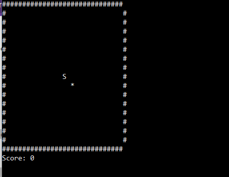
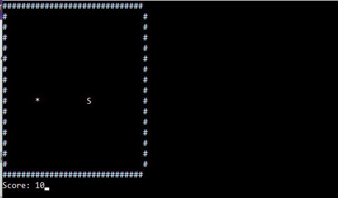
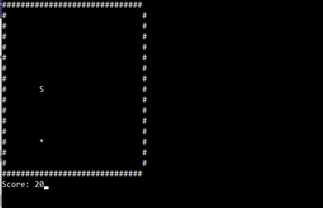
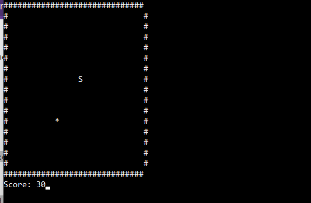
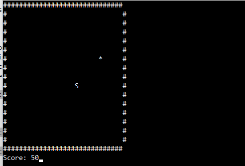
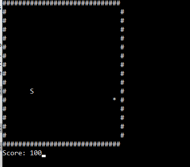

## Snake Game

This repository contains a snake game similar to the one from Nokia. The user will start moving the snake and collecting points. The more points that the snake collects the faster it will go. This program can be run and played on terminal. 

## Table of Contents 

1. [Description](#description)
2. [Implementation)(#implementation)
2. [Compile and Execution](#exe)
3. [Program Output](#output)

## Description 

The game consist on eating the fruit that is worth 10 points. The fruit is randomly placed around the map, and each time that the snake eats the fruit the score counter will increase by 10 points. Also, the speed of the snake will increase as the score gets higher. There is not really a limit of how many points the user can get, but the higher the score the harder it gets. The player will loose as soon as the snake touches one of the margins. 

## Implementation 

The snake game consist on an array x and y axis. The table will be drawn on shape of rectagle. Since the program is mostly functional to be run on terminal, I used a technique to refresh the screen everytime the snake eats the fruit so that the fruit can respawn on another side of the map. The board is being drawn using "#" and the snake is an "S". The program takes the x and y positive and negative axis to move from left, right, up and down.

## Compile and Execute 

- Windows:

	To compile run the command: `g++ snakemain.cpp snake.cpp snake.h -lncurses`

	To execute run the command: `./a.out`

- Linux / Mac OS:

	To compile run the command: `g++ main.cpp snake.cpp snake.h -lncurses`

	To execute run the command: `./a.out`

## Program Output 

 

